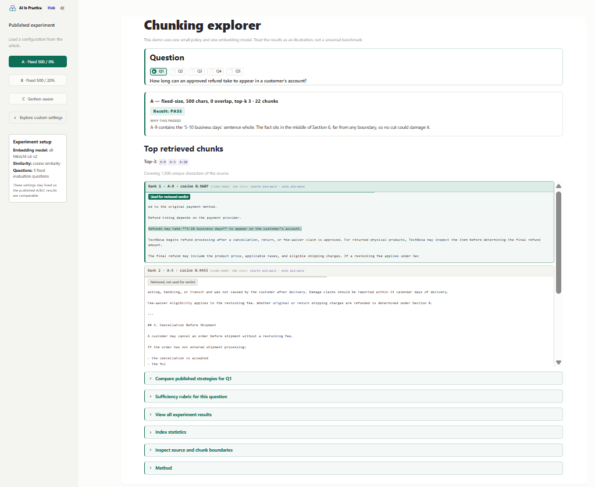

# Why Fixed-Size Chunking Breaks Retrieval — experiment code

A small, reproducible retrieval experiment over one document: the fictional
TechNova billing and cancellation policy. Plain Python, no framework
abstractions, so every chunk boundary is inspectable.

## From AI in Practice Hub

This repository accompanies the field note [Why Fixed-Size Chunking Breaks Retrieval](https://aiinpracticehub.com/articles/why-fixed-size-chunking-breaks-retrieval/).

It is part of [AI in Practice Hub](https://aiinpracticehub.com/), a collection of practical engineering notes and experiments covering:

- RAG and retrieval
- AI agents
- Model Context Protocol (MCP)

## Layout

```
config.py            frozen parameters: chunk sizes, overlap, top-k, model, questions, rubric
chunkers.py          two chunking approaches used in three published configurations
inspect_chunks.py    stage 1: build chunks and write them out for inspection
retrieve.py          stage 2: embed, rank by cosine similarity, write raw results
explorer_core.py     shared logic for the companion UI (delegates to chunkers/retrieve)
app.py               Streamlit companion UI
verify_preset.py     checks published A/B/C presets against frozen retrieval results
requirements.txt     stage 2 dependencies (stage 1 is standard library only)
requirements-ui.txt  Streamlit, kept out of requirements.txt
.streamlit/          theme for the companion UI
source/              byte-identical copy of the source document, never modified
outputs/             generated artifacts
LICENSE              MIT
```

## Strategies

| ID | Strategy | Rule |
|---|---|---|
| A | Fixed-size, no overlap | 500 characters, 0 overlap |
| B | Fixed-size, with overlap | 500 characters, 100 characters overlap |
| C | Markdown section-aware | split on `## ` headings, each heading kept with its section, sections left at natural length |

Configurations A and B slice raw characters, so boundaries land mid-sentence and
mid-table-row. Configuration C never re-cuts a section to 500 characters.

## Stage 1 — chunk inspection

```bash
python inspect_chunks.py
```

Writes `outputs/chunks_inspection.md` with, for every chunk: strategy, chunk
index, character count, source character range, and the exact chunk text, plus
per-strategy totals. Chunk text is an exact slice of the source, including
whitespace and `---` rules, so `A` and `C` chunks concatenate back to the
original document byte for byte.

Current counts: **A = 22 chunks, B = 28 chunks, C = 13 chunks** over 10,849
source characters.

## Stage 2 — retrieval

Fixed and frozen in `config.py`:

- embedding model `sentence-transformers/all-MiniLM-L6-v2`
- cosine similarity, computed as a dot product over L2-normalized embeddings
- top-k = 3
- no BM25, no reranking, no contextual retrieval, no LLM answer generation
- five frozen evaluation questions
- five frozen sufficiency-rubric entries, one per question

```bash
pip install -r requirements.txt
python retrieve.py
```

Chunks come from the stage 1 chunkers unchanged. `retrieve.py` writes
`outputs/retrieval_results.md`: a run-configuration log, the rubric, a compact
Question × Strategy table of retrieved chunk IDs, an empty manual-review table,
and then every hit in full with its cosine score, chunk index, source character
range, section heading where one exists, and exact chunk text. Ties resolve to
the lower chunk index.

Run once, with no parameter tuning afterwards.

## Sufficiency rubric

`config.SUFFICIENCY_RUBRIC` holds one criterion per question, written and
committed *before* the retrieval run so sufficiency is judged against criteria
chosen without knowledge of the results. `retrieve.py` never applies them: it
copies the rubric into the results file and leaves every verdict cell blank.
Deciding sufficient or insufficient is a manual step.

The script refuses to run while the rubric is empty or while its length does not
match `QUESTIONS`, so results cannot be observed before the criteria exist.

## Companion UI

A reader-facing companion explorer for the article. It is not a separate benchmark:
it re-runs the same retrieval pipeline while letting a reader vary chunk size
(300, 500, 800), overlap (0%, 10%, 20%), strategy, top-k (3, 5), and which of the
five frozen questions is asked.



```bash
pip install -r requirements.txt -r requirements-ui.txt
streamlit run app.py
```

The UI adds no new retrieval logic. It imports `fixed_size_chunks` and
`markdown_section_chunks` from `chunkers.py` and `embed` and `rank_chunks` from
`retrieve.py`, so normalization and tie-breaking are the same code, and only
chunking settings and top-k vary.

### Sidebar

- **Published experiment** — load article presets A, B, or C
  (A: 500 chars / 0 overlap; B: 500 chars / 100 overlap; C: `##` sections; each at
  top-k 3). Overlap percentages resolve to characters as `round(size × pct/100)`,
  so 500 at 20% is exactly 100.
- **Explore custom settings** — strategy, size, overlap, and top-k for exploratory
  runs (collapsed by default when a published preset is active).
- **Experiment setup** — fixed model, cosine similarity, and the five evaluation
  questions (held constant so A/B/C stay comparable).

To confirm the presets still match the frozen run:

```bash
python verify_preset.py
```

That compares chunk counts and top-3 chunk IDs against the values in
`outputs/retrieval_results.md` and exits non-zero on any mismatch. It writes
nothing.

### Main page (reader flow)

The main column stays on the **currently selected** configuration:

1. Question (Q1–Q5)
2. Selected configuration heading, including chunk count  
   (e.g. `A — fixed-size, 500 chars, 0 overlap, top-k 3 · 22 chunks`)
3. `Result: PASS` / `Result: FAIL`, or `Result: No published verdict` when
   exploring a non-published combination
4. Why this passed / failed (published) or inspect-evidence guidance (exploratory)
5. Top retrieved chunks for that configuration
6. Optional expanders for deeper inspection

Cross-strategy comparison is optional, not always on screen: **Compare published
strategies for Qx** shows the frozen A/B/C Pass/Fail for the selected question.
Further expanders cover the sufficiency rubric, the full published verdict grid
and top-k IDs, index statistics, source/chunk boundaries, and method notes.

**Top retrieved chunks** are primary. For published presets, frozen reviewed
evidence spans (where recorded) are highlighted. On a PASS, those cards are
tagged **Used for reviewed verdict**. On a FAIL, a retrieved span named in the
review that does not complete the required set is amber **Required evidence**,
matching the Retrieval explorer. Other retrieved cards are tagged
**Retrieved, not used for verdict**.

**Inspect source and chunk boundaries** (expander) defaults to **Retrieved chunks
only**: retrieved chunks in document order, with runs of non-retrieved chunks
collapsed into a single marker (e.g. `14 chunks not retrieved · Chunk 13 – Chunk 26`),
so top-k competition is visible without reading the whole document. **All chunks**
shows every boundary. Index statistics describe the full chunk set; overlap
duplication is broken out explicitly, for example under configuration B:

```
Source        10,849 chars
Indexed       13,498 chars
Duplicated     2,649 chars (+24%)
Chunks              28
Chunk size    min 49 · mean 482 · max 500 chars
```

### Sufficiency and explanations

Never judged automatically, and no LLM is involved. The UI shows the rubric for
the selected question. When the active settings exactly match a published
configuration it also shows the hand-authored verdict from
`config.PUBLISHED_SUFFICIENCY` and a one-sentence explanation from
`config.PUBLISHED_OBSERVATIONS` ("Why this passed" / "Why this failed"). Both are
written by hand for those three configurations only. Every other combination shows
`Result: No published verdict` and asks the reader to inspect the retrieved
evidence against the rubric — nothing is inferred.

`config.SUFFICIENCY_RUBRIC` holds the rubric exactly as frozen before the run, so
`retrieve.py` still reproduces `outputs/retrieval_results.md` byte for byte. The UI
reads `config.SUFFICIENCY_RUBRIC_DISPLAY`, which differs in one place: the Q5 entry
was reworded afterwards to state plainly that the generic Section 6 "may inspect"
sentence is not sufficient on its own. That rewording narrows the criterion and
changes no recorded verdict. A passes on the matrix row plus the table header, B
retrieves no part of the table, and C passes on the complete table in C-8. For
C's Q5 verdict, C-8 is the only retrieved chunk used.

## Experiment 2 — Retrieval Failure Analysis

Holds chunking fixed at section-aware configuration C (13 chunks) and varies
the retrieval method: Dense, BM25, and RRF. That is the experiment behind
[One Retrieval Method Is Not a Diagnosis](https://aiinpracticehub.com/articles/one-retrieval-method-is-not-a-diagnosis/).

All Experiment 2 files live under `experiment-2-retrieval/`:

- `PRE-REGISTRATION.md` — frozen spec, written before the retrieval run
- `outputs/retrieval_results.md` — frozen full rankings and verdicts
- `site-artifact/retrieval-diagnosis.json` — publication JSON read by the Retrieval explorer

The headline Q3 result: Dense places required evidence C-3 at rank 5 and C-8 at
rank 6, so the required-evidence group (`C-7` and `C-3` or `C-8`) fails at
published top-3. BM25 and RRF pass the same frozen question.

```bash
pip install -r requirements.txt -r requirements-ui.txt
streamlit run app.py
```

Then open **Retrieval explorer**. That page reads the frozen JSON only. It does
not rerun Dense, BM25, or RRF.

## Ground rules

For the frozen A/B/C experiment, the source document, questions, chunking
parameters, embedding model, top-k, and evaluation rules remain fixed. The
companion UI reads this code but never regenerates the files in `outputs/`.
